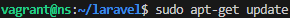
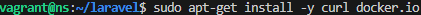
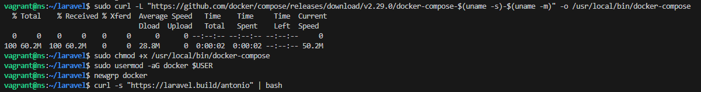
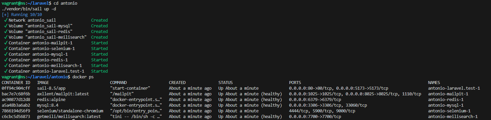
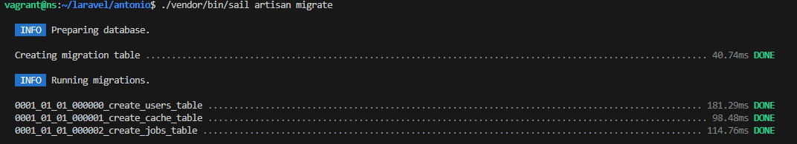
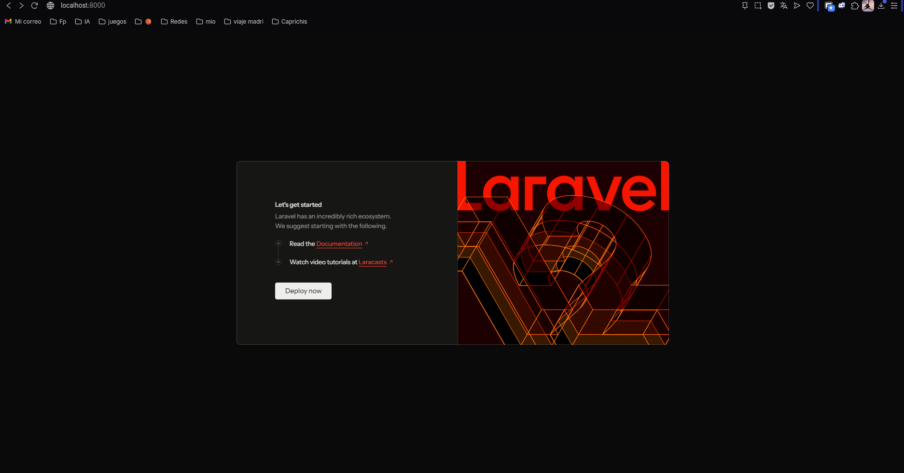
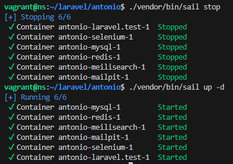
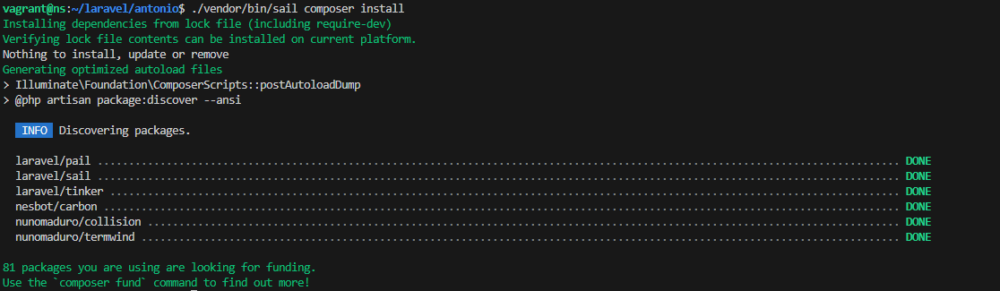
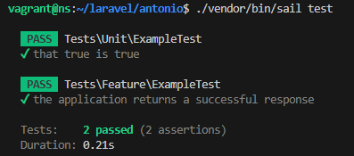

# Entorno de Desarrollo de Laravel con Contenedores (Docker)

**Alumno:** Antonio Benítez García  
**Módulo:** Despliegue de Aplicaciones Web  
**Curso:** 2025-2026

---

## 1. Introducción

En esta práctica se documenta el despliegue de una aplicación **Laravel** utilizando la tecnología de contenedores **Docker**. Para facilitar la orquestación del entorno de desarrollo, hemos utilizado **Laravel Sail**, una interfaz ligera de línea de comandos para interactuar con el entorno Docker predeterminado de Laravel.

El objetivo es levantar un stack tecnológico completo (Servidor Web, PHP, MySQL, Redis, etc.) sin necesidad de instalar software directamente en la máquina anfitriona, garantizando la portabilidad, el aislamiento del proyecto y la reproducibilidad del entorno.

---

## 2. Preparación del Entorno

### Actualización e Instalación de Dependencias
Partimos de una máquina virtual limpia. Antes de desplegar el proyecto, es necesario preparar el sistema actualizando los repositorios e instalando el motor de contenedores (**Docker**) junto con las herramientas de red necesarias (`curl`).

A continuación, instalamos Docker y Docker Compose, que serán los encargados de levantar y orquestar los contenedores.

---

## 3. Instalación y Despliegue del Proyecto

Una vez preparado el entorno, utilizamos el script de construcción automatizado de Laravel. Este script descarga una imagen Docker mínima, instala las dependencias de PHP/Composer y genera la estructura del proyecto llamado `antonio`.

Una vez finalizada la construcción, levantamos el entorno en modo "detached" (segundo plano) mediante el comando `./vendor/bin/sail up -d`.

---

## 4. Verificación de Servicios

Para confirmar que la arquitectura de microservicios se ha desplegado correctamente, listamos los contenedores activos.

Como se observa en la captura, Sail ha levantado automáticamente un ecosistema completo:
* **laravel.test:** El contenedor de la aplicación (PHP + Servidor Web).
* **mysql:** El motor de base de datos.
* **redis:** Sistema de caché en memoria.
* **meilisearch:** Motor de búsqueda.
* **selenium:** Para pruebas de navegador.
* **mailpit:** Para intercepción de correos en desarrollo.

---

## 5. Persistencia y Base de Datos

Uno de los pasos críticos es verificar la conectividad entre el contenedor de la aplicación y el de la base de datos. Para ello, ejecutamos las migraciones, que crean las tablas iniciales en MySQL.

**Resultado:** La ejecución exitosa de `sail artisan migrate` confirma que la red interna de Docker está funcionando correctamente y que la aplicación tiene permisos de lectura/escritura sobre la base de datos.

---

## 6. Comprobación Final

Finalmente, accedemos a la aplicación desde el navegador del sistema anfitrión. Gracias al mapeo de puertos realizado por Docker (o mediante un túnel SSH si estamos tras un firewall estricto), visualizamos la página de bienvenida de Laravel.

---

## 7. Mantenimiento y Ciclo de Vida

Para demostrar el control total sobre el entorno y asegurar que no hay pérdida de datos al reiniciar, realizamos tareas de parada y arranque.

### Gestión de Contenedores (Stop/Start)
Utilizamos `sail stop` para detener ordenadamente todos los servicios y `sail up -d` para reactivarlos. Esto demuestra que el entorno es recuperable y persistente.

### Comandos de Mantenimiento
Es posible ejecutar comandos de mantenimiento del framework, como la limpieza de caché o configuración, directamente contra el contenedor.

### Ejecución de Tests Unitarios
Como paso extra de validación de calidad, ejecutamos la batería de pruebas unitarias que incluye Laravel (`sail test`). Esto verifica que el código fuente de la aplicación es estable y funciona correctamente dentro del entorno aislado.

---
